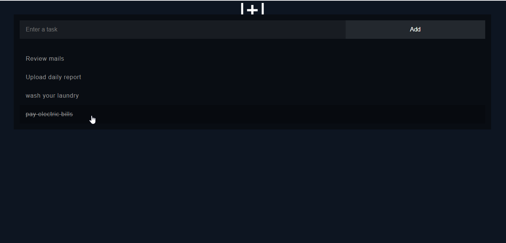

 

<!--
   -->

  <h1 align="center">📅Simple-Event-Reminder</h1>
<!--
  

     
    <a href="https://github.com/othneildrew/Best-README-Template"><strong>Explore the docs »</strong></a>
     
     
    <a href="https://github.com/othneildrew/Best-README-Template">View Demo</a>
    ·
    <a href="https://github.com/othneildrew/Best-README-Template/issues">Report Bug</a>
    ·
    <a href="https://github.com/othneildrew/Best-README-Template/issues">Request Feature</a>
  

  -->

<!-- ABOUT THE PROJECT -->
## About The Project

A simple full stack application made using Node.js and MongoDB to add and delete events.  

### Built With

- Nodejs
- Express
- MongoDB

### Prerequisites

`npm` `node` `mongo`

### Installation

- `npm i` or `yarn`
-  Create a `.env` file inside the app
-  Insert  `PORT = PORT_NUMBER ` `DB_NAME = YOUR_DB_NAME`
- `node server`

<!-- CONTACT -->
## Contact

Your Name - [Rohan Mistry](https://www.linkedin.com/in/rohan-mistry-826714180/) - mistryrohan13@gmail.com

Project Link: [https://github.com/rohan-mistry/Event-Reminder](https://github.com/rohan-mistry/Event-Reminder)

